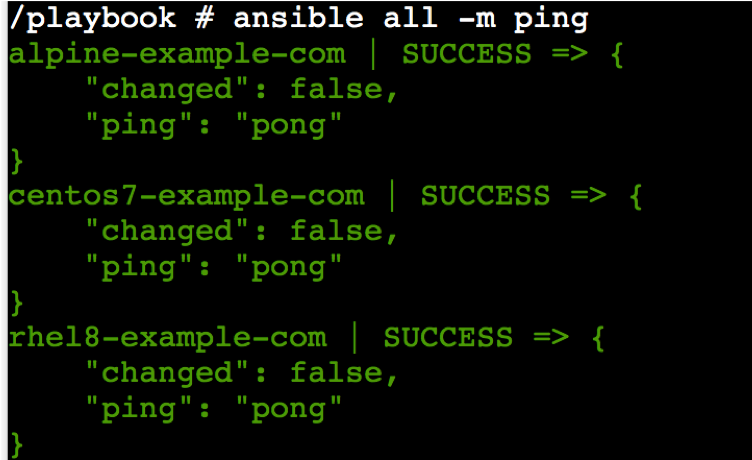
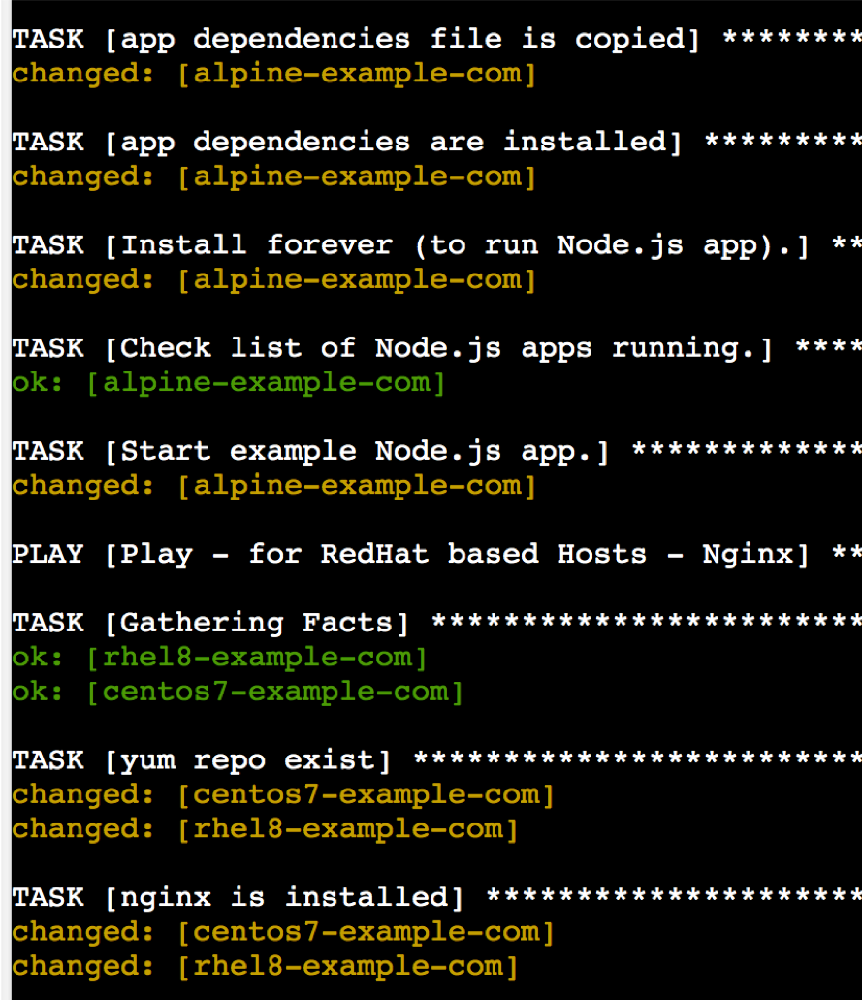
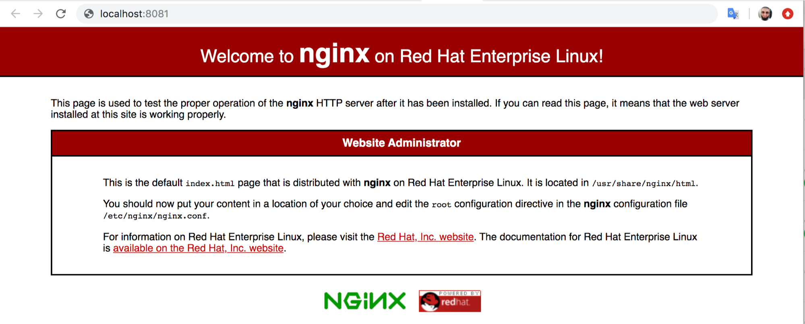
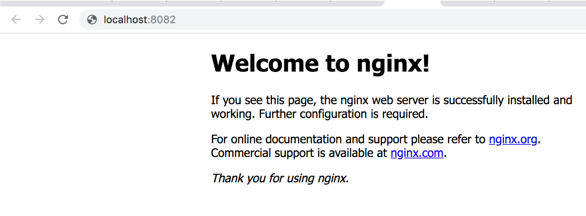
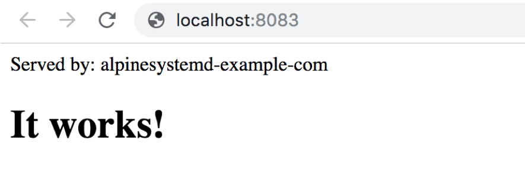

A fully dockerized environment to play with ansible.

# Prerequisites:

- Docker
- Docker Compose
- [ kubectl ]
# Lab Architecture : 

## Nodes
 This Lab consists of 5 containers:

 - 1 control node container (control-node).

 - 5 managed hosts containers :

    * Alpine with SSH connection (ansible_connection=ssh)
    * RHEL8 with docker connection (ansible_connection=docker)
    * CentOS7 with docker connection (ansible_connection=docker)
    * Alpine+systemd with docker connection (ansible_connection=docker)

All these containers are defined in [docker-compose.yml](docker-compose.yml)

## Playbook Sample

The playbook sample is under [playbook-example/hello.yml](playbook-example/hello.yml).

It consists of 4 plays: 

* First play: target all managed hosts to create a simple file

* Second play: targets the alpine node to run NodeJS app (running inside container on port 3000, running externally on port 3001 - check [docker-compose](docker-compose.yml) )

* Third play: targets both RedHat containers ( rhEL8, centos7) to run nginx (conclude exposed ports from [docker-compose](docker-compose.yml)  )

* Fourth play: target Alpine-systemd container to run Apache Web server ( external port 8083)

# Configuration

- RHEL8 and CentOS7 containers does not need pre configuration as it used `ansible_connection=docker`.

- Alpine container requires pre-configuration as ansible connects to it thru SSH :

* Generate SSH key pair in `./secrets` directory:

```sh
ssh-keygen -t rsa -N "" -f secrets/id_rsa
```


# Using compose

**Setup**

```sh
docker-compose up -d
```

**Play**

```sh
## 
docker-compose exec controlnode ash
########
/playbook $ ansible all --list-hosts 
## alpine-example-com
## centos7-example-com
## rhel8-example-com

/playbook $ ansible all -m ping
```




```sh
## 
docker-compose exec controlnode ash
########

# run the playbook sample:
/playbook $ ansible-playbook hello.yml
```




**Validation**

on your host, navigate to :
- http://localhost:3001 , app (node) run in alpine node


- http://localhost:8081 , app (nginx) runs in rhel8 node




- http://localhost:8082 , app (nginx) runs in centos7 




- http://localhost:8083 , app (apache) runs in alpine-systemd



**Cleanup**

```sh
docker-compose down
```

# Using Kubernetes + compose

**Setup**

```sh
export stackname=infra-ansible
export DOCKER_STACK_ORCHESTRATOR=kubernetes
docker stack deploy -c docker-compose.yml ${stackname}
```

**Play**


```sh
# Get podID of control node
controlnode_podid=$(kubectl get pods -lcom.docker.service.id=${stackname}-controlnode -o jsonpath='{.items[0].metadata.name}')
kubectl exec -it ${controlnode_podid} ash

########
/playbook $ ansible all --list-hosts 
/playbook $ ansible alpine-example-com -m ping
# run the playbook sample:
/playbook $ ansible-playbook hello.yml
```


**Cleanup**

```sh
docker stack rm ${stackname}
```